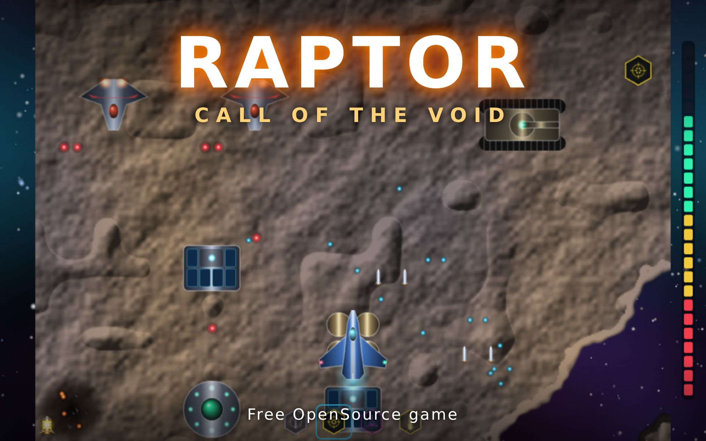

# Promotion of this game

- Hosted at [entorb.net/raptor/](https://entorb.net/raptor/)
- OpenSource, code at [GitHub Repository](https://github.com/entorb/raptor)

## Posts in Social Media

If you like it, please spread the word

### Reddit

- [[4] r/opensourcegames](https://www.reddit.com/r/opensourcegames/comments/1x27xau/raptor_call_of_the_shadows_1994_opensource_web/)
- [[3] r/WebGames](https://www.reddit.com/r/WebGames/comments/1x27x0u/)
- [[2] r/itchio](https://www.reddit.com/r/itchio/comments/1wx1tto/raptor_call_of_the_void/)
- [[1] r/Apogee comment on "Remaster of Raptor Call of the Shadows by Original Developer"](https://www.reddit.com/r/Apogee/comments/1tadmf2/comment/pcrk12u/)

### Mastodon

- [[2] @play_webgl](https://norden.social/@enTorb/117381481411564047)
- [[1]](https://norden.social/@enTorb/117353860910855344)

### BlueSky

- [[1]](https://bsky.app/profile/entorb.bsky.social/post/3mwqy5l5l3s27)

### Itch.io

- [[2] blog post](https://itch.io/t/7052078/raptor-call-of-the-void#post-17508733)
- [[1] game page](https://entorb.itch.io/raptor)

### LinkedIn

- [[1]](https://www.linkedin.com/feed/update/urn:li:activity:7509952559386918912/)

<!-- cspell:words itchio opensourcegames -->
